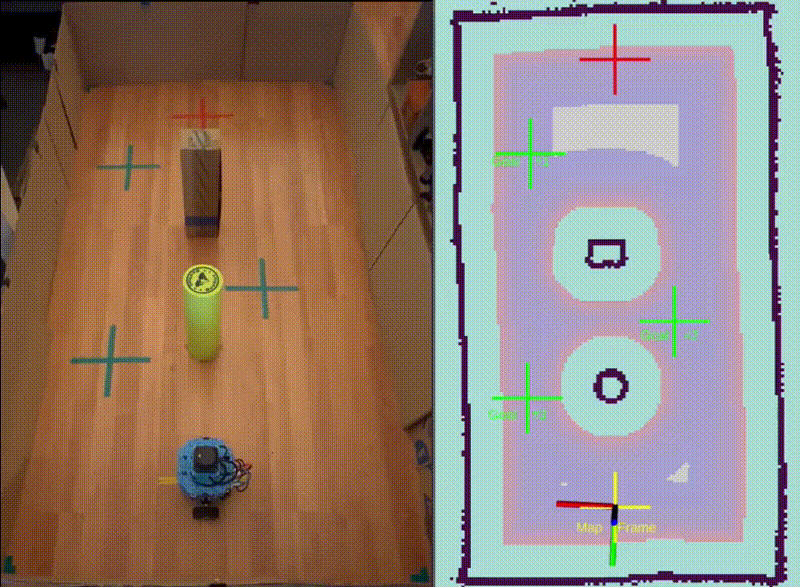

# Nav2 Autonomous Navigation Demo

Complete ROS 2 Humble setup for autonomous navigation in a constrained environment using Nav2, slam_toolbox, and a custom TurtleBot platform.

## 🎯 Project Overview

This project demonstrates autonomous navigation with:
- **Precision**: ≈ 2–3 cm accuracy
- **Map resolution**: 0.02 m/pixel for stable path planning
- **Environment**: 1.04 m × 1.91 m rectangular playground with obstacles
- **Stack**: ROS 2 Humble + Nav2 + slam_toolbox
- **Demo video**:
  [Link to LinkedIn post](https://lnkd.in/ejisJFqK)
  

## 📁 Repository Structure

```
nav2-autonomous-demo/
├── README.md
├── LICENSE
├── config/
│   ├── nav2_params.yaml          # Nav2 configuration
│   ├── slam_toolbox_params.yaml  # SLAM parameters
│   └── simple_nav_bt.xml         # behavior tree for navigation
├── launch/
│   ├── real_robot_pc.launch.py    # Main navigation launch file (laptop)
│   ├── real_robot_pc_mapping_mode.launch.py # Launch file to build the map (laptop)
│   └── real_robot_pi.launch       # Main navigation launch file (robot - raspberry)
├── maps/
│   ├── playground_post_3_hd.data #  Actual scan data (laser measurements) 
│   ├── playground_post_3_hd.posegraph # serialized pose graph 
│   ├── playground_post_3_hd.yaml # Map metadata
│   └── playground_post_3_hd.pgm  # Map image
├── rviz/
│   └── nav2_view.rviz            # RViz2 configuration
├── media/
│   ├── demo.gif                  # Demo video (for github) 
│   └── post_3_demo_2_screens.mp4 # Demo video
└── scripts/
    └── save_map.sh               # Build the map (4 files generated)
    
   
`
## 🚀 Quick Start

### Prerequisites
- ROS 2 Humble
- Nav2 navigation stack
- slam_toolbox
- Custom TurtleBot hardware (or adapt to your robot)

### Installation

```bash
# Clone the repository
cd ~/ros2_ws/src
git clone https://github.com/YOUR_USERNAME/nav2-autonomous-demo.git


## ⚙️ Configuration Highlights

### Key Parameters

**Planner**: NavfnPlanner  
**Controller**: RegulatedPurePursuitController  
**Goal Checker**: SimpleGoalChecker

**Critical Settings:**
- Map resolution: `0.02 m/pixel`
- Linear deadband: `≥ 0.19 m/s`
- Angular deadband: `≥ 1.0 rad/s`
- Yaw goal tolerance: `0.40 rad` (disabled rotate_to_heading to prevent overshoot)
- Lookahead distance: `≥ 0.15 m`

### Costmap Configuration

- 🩵 **Light blue**: Non-traversable areas
- 🟥 **Red → 🟦 Blue**: Decreasing navigation cost
- ⬜ **White**: Free space

## 🎥 Demo Results

The robot successfully:
- ✅ Follows 3 waypoints autonomously
- ✅ Navigates between two obstacles
- ✅ Returns to base position
- ✅ Achieves 2–3 cm positioning accuracy
- ✅ Maintains smooth trajectories despite motor deadband

**Observable behaviors:**
- Smooth path planning at 0.02 m resolution
- Natural speed reduction near goals
- Real-time slam_toolbox corrections (3–4 cm lateral adjustments)

## 💡 Key Learnings

1. **Deadband calibration is critical** - prevents ineffective micro-commands that cause motor buzzing
2. **Map resolution matters** - 0.02 m provides excellent costmap precision
3. **Yaw tolerance tuning** - relaxed tolerance improves goal convergence
4. **Controller smoothing** - proper lookahead distance maintains trajectory stability

## 🔧 Tuning Guide

See [docs/TUNING.md](docs/TUNING.md) for detailed parameter tuning process covering:
- Deadband identification and compensation
- Costmap resolution selection
- Controller parameter optimization
- Goal checker configuration

## 📊 Hardware Specifications

- **Platform**: Custom TurtleBot
- **LiDAR**: C1 Slamtech Lidar
- **Compute**: Raspberry PI4 - 8Gb
- **Motors**: [Motor specifications with deadband characteristics]

## 🔗 Related Posts

This is part of a tutorial series on autonomous navigation:
1. **LiDAR Installation & Setup** (https://www.linkedin.com/posts/activity-7378673734053728256-MY8H?utm_source=share&utm_medium=member_desktop&rcm=ACoAAAEHoVsBb5CZMJMBRR1l8eFgTdJ5nfV3NKE)
2. **SLAM Mapping**(https://www.linkedin.com/posts/activity-7386283866417700864-f7-4?utm_source=share&utm_medium=member_desktop&rcm=ACoAAAEHoVsBb5CZMJMBRR1l8eFgTdJ5nfV3NKE)
3. **Autonomous Navigation with Nav2** (this project)

## 📝 License

MIT License - see LICENSE file

## 🤝 Contributing

Contributions welcome! Please open an issue or PR.

## 📧 Contact

Alain Meil - https://linkedin.com/in/alain-meil-50b9525

---
